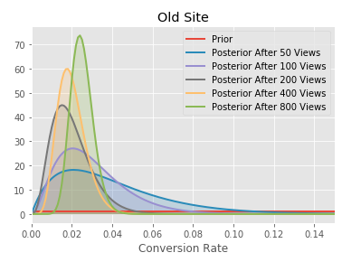
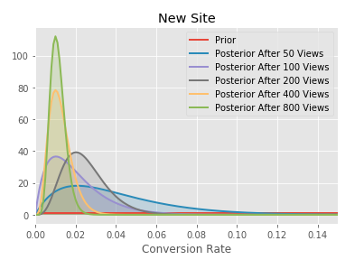
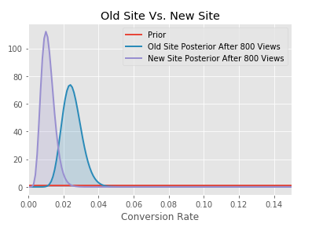
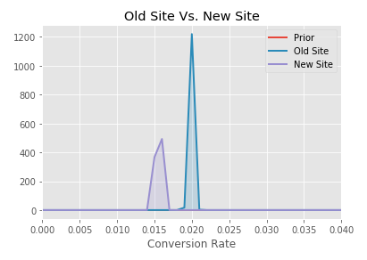

# Software Pricing Test
Bayesian A/B analysis for software pricing

## Goal

Company XYZ sells a software for $39. Since revenue has been flat for some time, the VP of Product has decided to run a test increasing the price. She hopes that this would increase revenue. In the experiment, 66% of the users have seen the old price ($39), while a random sample of 33% users a higher price ($59).

## Questions
1. Should the company sell its software for $39 or $59?

2. What are the main findings looking at the data, particularly related to user behavior behavior and conversion rate?

3. The VP of Product feels that the test has been running for too long and she should have been able to get statistically significant results in a shorter time. Do you agree with her intuition? After how many days would you have stopped the test?

## Analysis
Due to concerns that the test has been running for too long, a Bayesian A/B approach was taken to obtain meaningful results more quickly. Data was split based on price and the label conversion/no conversion was used.

## Results
The new site with higher price has a lower conversion rate overall.

After simulating 800 views, the new site has a lower conversion rate, though the distributions overlap.

However, simulation of 10,000 views demonstrates 100% probability that the old site will have a higher conversion rate.

**But wait!**

 This does not mean the company should stick with the old price! When calculating the profit difference between the two prices, the higher prices results in greater profit even despite lower conversion rates. For instance, the expected profit difference after 10,000 hits is almost $3,000 for the new price.

## Conclusion

In conclusion, while the conversion rate is lower for the new price, the profit per hit is sufficient such that the company may justify increase the selling price.

The VP of Product is also correct in thinking that she would be able to get results in a shorter amount of time. With a Bayesian approach, we determined that while the old site is better for conversion, the profit of the new site conversions justify the increase in price after ~800 visits. With a Frequentist approach, we would have waited for ~300,000 visits to the site to obtain a result.
